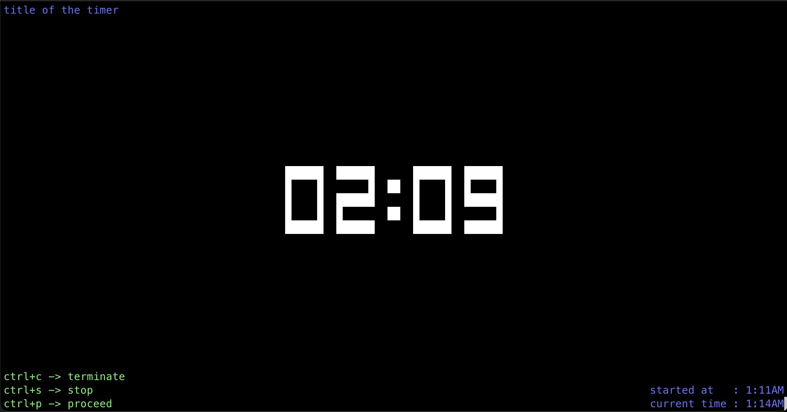

# Timer CLI

Timer console app.

```shell
go install github.com/semihbkgr/timercli@latest
```

Starting timer:

```shell
$ timer #stopwatch
$ timer [duration] #countdown
```

'duration' arg is a possibly signed sequence of decimal numbers, each with optional fraction and a unit suffix, such as "300ms", "-1.5h" or "2h45m".

Listing available args:

```shell
$ timer -h
```

- -T : title of timer
- -t : theme of the renderer [dark, light]

OS signals to control timer

- Ctrl + C : terminate
- Ctrl + S : stop
- Ctrl + P : proceed


